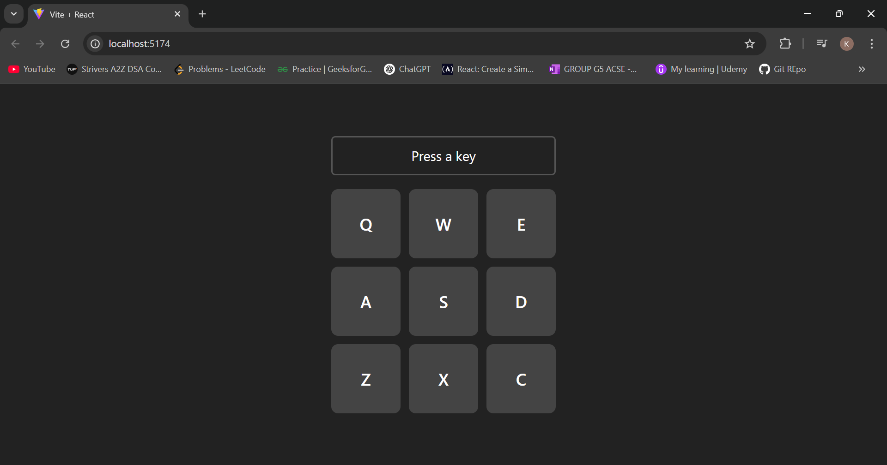

# 🥁 Drum Machine

A simple and interactive drum machine built using **React** and **Vite**. Users can play drum sounds by clicking on drum pads or using specific keyboard keys.

Also can check the working model on this link : https://codepen.io/kshandilaya/pen/pvjvNNZ

## 📸 Demo

Here’s a preview of the Drum Machine interface:

## 🚀 Features

- 9 clickable drum pads
- Keyboard-triggered sound playback
- Visual feedback when a pad is pressed
- Responsive and clean layout
- Built with functional React components

## 🧰 Tech Stack

- React
- Vite
- HTML5 Audio
- CSS

